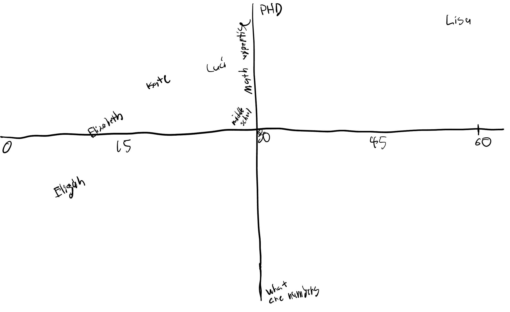
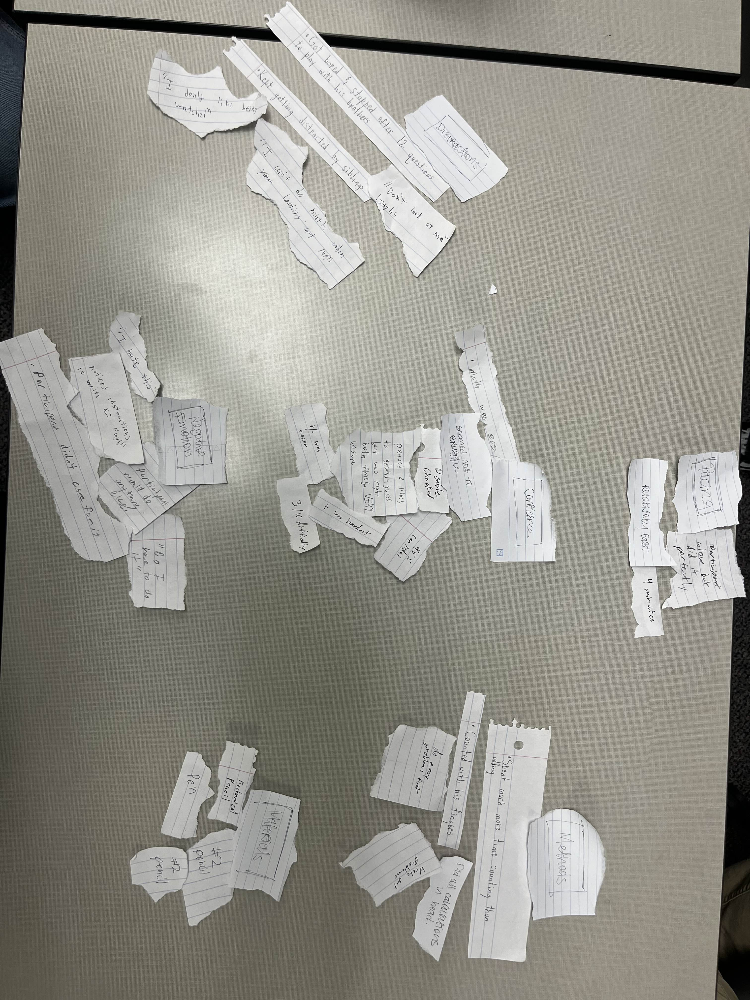

# Contextual Inquiry Activity

> Group 8

## Research Participant Map

## Affinity Diagram

## Reflection

- What went well?
- What didn't go well?
- What would you do differently if you had to do it again?

### Reflection - Luci England

### Reflection - Andrew Carlson

- It really worked nicely that we had a wide spread of different people from different age ranges and that the differences in the ways all the people took the assesment was very interesting.
- The Affinity Diagram showed similarities between all the different groups and the information we collected was slightly different which caused each indiviual interview as very distinct more than usual.
- It would be beneficial I feel to have an activity where you also highlight the differences in the information and compare and contrast in some way.

### Reflection - Grant Peters

### Reflection - Tait Vasa

### Reflection - Xavier Young
