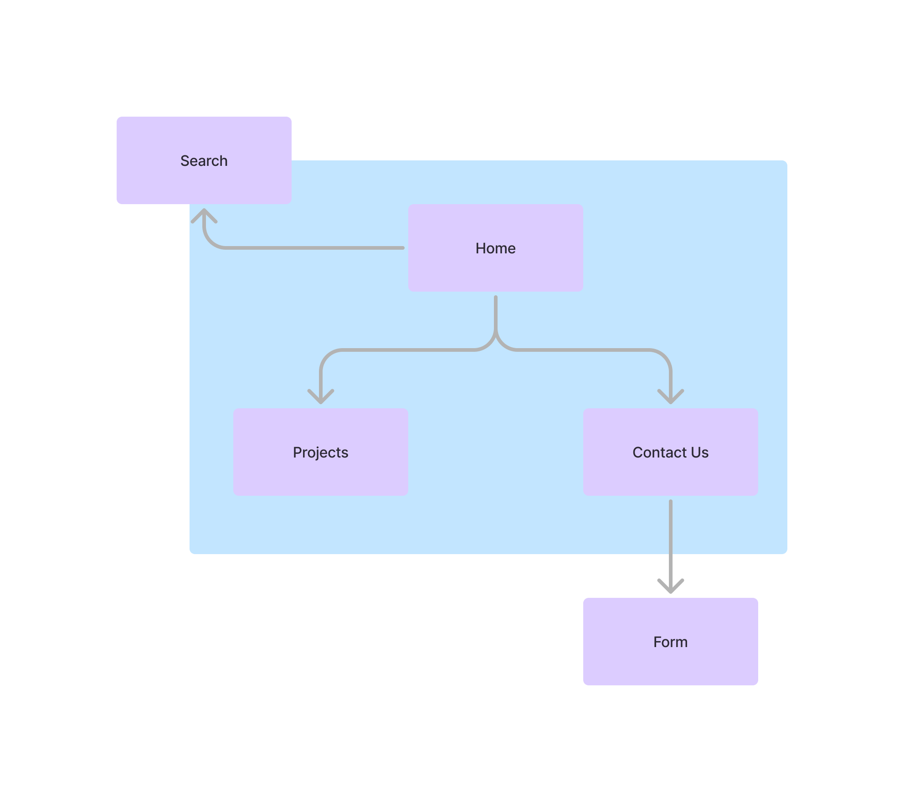
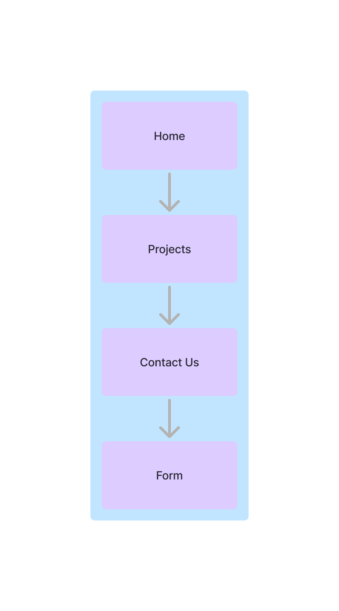

# Mapping Methods + Toddle Activity

> Andrew Carlson
> [Carlson Building Group](www.carlsonbg.com)
> [www.carlsonbg.com](www.carlsonbg.com)
> [Toddle Prototype](https://start-salmon_r2_d2_influential_viper.toddle.site/)

## Questions

- One thing you think works about the design?

*It is very simple and small making it very easy to follow and find all the information that you need to find or that you are curious about. There is a color sceme throughout the whole page and logoing and branding are very prominent and important.*

- One thing you think does not work about the design?

*There isn't enough. If I were to be given this page I would think that this website for a small company. It is for a small company but in this case that is not a good thing. If it were to look less dull and cookie cutter then it would really improve the look and feel of the website. More content would be good to sell people even further as to why you should hire this company for the job.*

- One thing that is okay but could be improved?

*There is a form in the webpage that it itself is scrollable. It works and is practical but I don't really like it and I think it would look much better if it was more well integrated into the webpage.*

- come up with a clear Problem Definition
    - A single sentence that explains the gap between curret stat and user need

*A person who is looking to build or fix some building needs a company with a  website that is interesting, persuasive, and professional, the website is rather boring, unconvincing and slightly unprofessional.*

- Citing at least one of the laws of UX, how could you improve the design.

*Aesthetic-Usability Effect: even though the design kind of works and the website works very well it may seem harder to find information than it actually is because it is rather uninteresting. It is harder for a previewer to read what information they need from the website.*

## Map of the existing design

## Map of the proposed design

